# SV2 Projektdokumentation

## Gruppenmitglieder

- Jan Obernberger
- René Ott
- Dennis Mayer
- Frank Mayer

## Planung

### C4 Modell

#### Layer 1

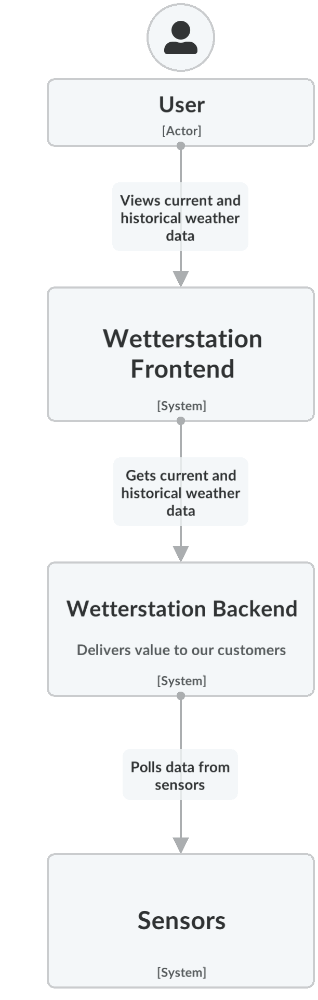

#### Layer 2

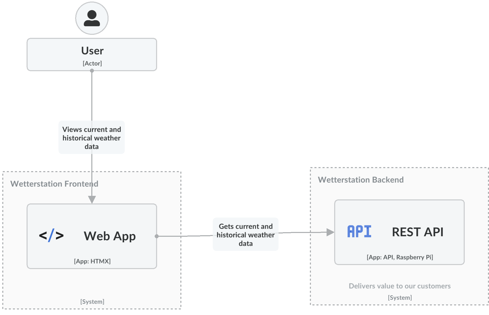

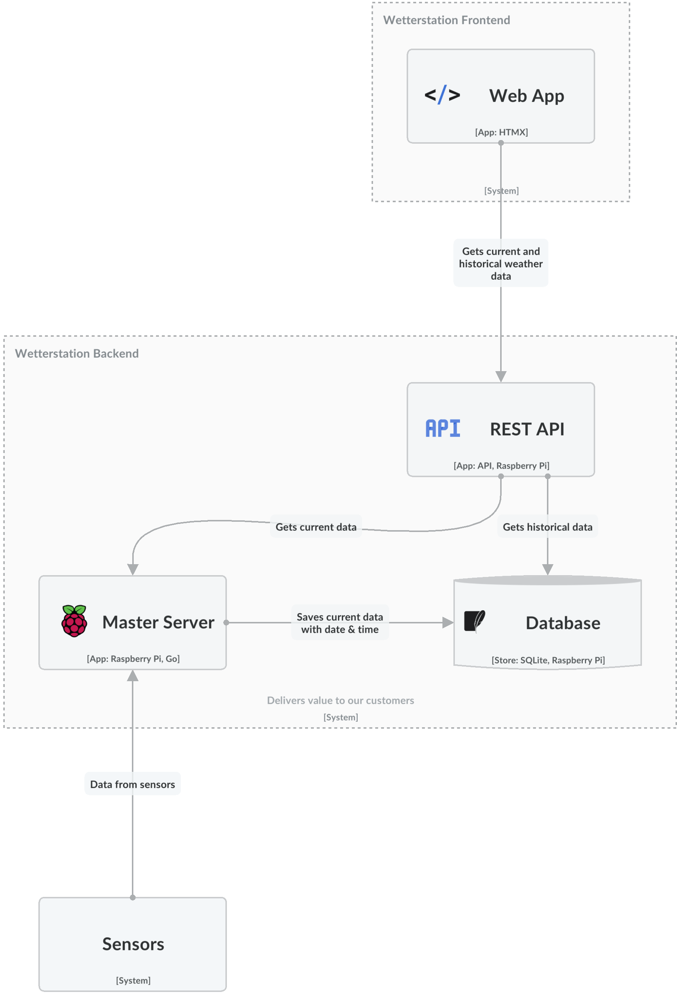

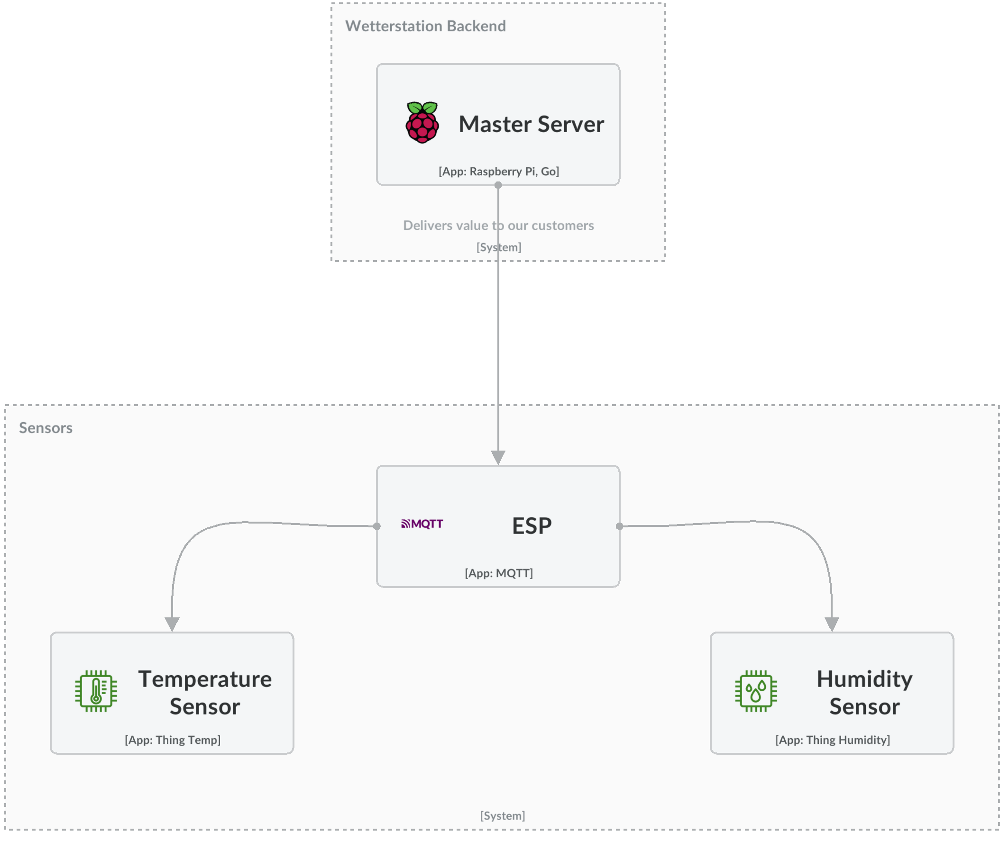

## Hardware

Für das Hosting unserer Website sowie die Verarbeitung und Speicherung der Messdaten haben wir uns für einen Raspberry
Pi entschieden. Dieser bietet ausreichende Leistung, um eine komplexe Single-Page-Webanwendung samt Datenbank effizient
zu betreiben.

Im Bereich der Sensorik und Aktorik fiel unsere Wahl auf den ESP32. Dieser Mikrocontroller ist ein Standard in diesem
Anwendungsgebiet und überzeugt durch seine Vielseitigkeit und Zuverlässigkeit. Für die Energieversorgung setzen wir auf
bewährte Standard-Li-Ionen-Zellen.

Ein wesentlicher Vorteil beider Systeme ist das umfangreiche Angebot an Programmierressourcen, was uns eine flexible und
effiziente Entwicklung ermöglicht.

In der Anfangsphase unseres Projekts planten wir den Einsatz verschiedener Sensoren in Kombination mit dem ESP32. Im
Laufe der Entwicklung mussten wir jedoch Anpassungen vornehmen und uns auf eine Auswahl an Sensoren beschränken, die
unseren Anforderungen am besten entsprachen.


Um die Anforderung zu erfüllen, einen Aktor repräsentativ über die Netzwerkverbindung steuern zu können, entschieden wir
uns für eine einfache und effektive Lösung: die Verwendung einer LED. Die LED dient als idealer Demonstrator für die
Fähigkeit des ESP32, über das Netzwerk Befehle zu empfangen und umzusetzen. Diese Wahl ermöglicht es uns, die
Netzwerksteuerung auf eine zugängliche und anschauliche Weise zu demonstrieren, ohne dabei auf komplexere oder
kostenintensive Aktorik zurückgreifen zu müssen.

#### Probleme

Wir stießen auf ein unerwartetes Problem: Der Sensor, den wir als Ersatz erhalten hatten, erwies sich leider als defekt.
Ein deutliches Indiz für das Problem war, dass unsere I²C Scanner-Skripte, die auf dem ESP ausgeführt wurden, den Sensor
nicht erkennen konnten. Dies war ein Rückschlag für unser Projekt, da wir dadurch Zeit verloren und gezwungen waren,
unsere Herangehensweise zu überdenken und nach Alternativlösungen zu suchen.

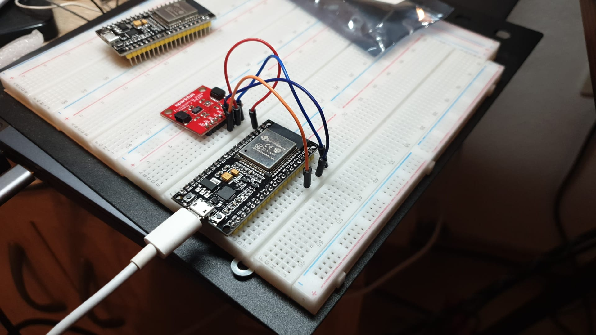

Nachdem wir auf das Problem mit dem defekten Sensor gestoßen waren, informierten wir umgehend unseren Betreuer über die
Situation. Um das Projekt weiterhin erfolgreich voranzutreiben, schlugen wir eine alternative Lösung vor: den Einsatz
eines DHT22-Sensors, den ein Mitglied unseres Teams zu Hause hatte. Dieser Sensor, bekannt für seine Zuverlässigkeit bei
der Messung von Temperatur und Luftfeuchtigkeit, schien eine praktikable und unkomplizierte Alternative zu sein, die es
uns ermöglichen würde, das Projekt ohne größere Verzögerungen fortzusetzen.

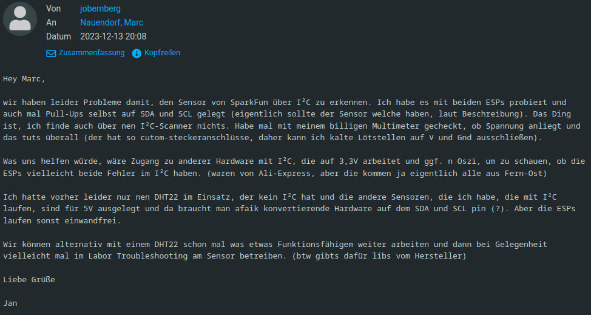

### Außenstation

In der weiteren Planung entschieden wir uns für ein minimalistisches Konzept für die Außenstation. Unser Ziel war es,
die Funktionalität zu maximieren, während wir gleichzeitig die Komplexität und die Anzahl der verwendeten Komponenten
minimierten. Dieser Ansatz sollte nicht nur die Effizienz und Zuverlässigkeit unserer Außenstation verbessern, sondern
auch die Wartung und mögliche Fehlerbehebung vereinfachen. Durch die Konzentration auf wesentliche Elemente wie den
zuverlässigen DHT22-Sensor und die effektive Nutzung des ESP32 konnten wir ein schlankes, aber leistungsfähiges System
entwickeln, das optimal für den vorgesehenen Einsatz im Freien geeignet ist.

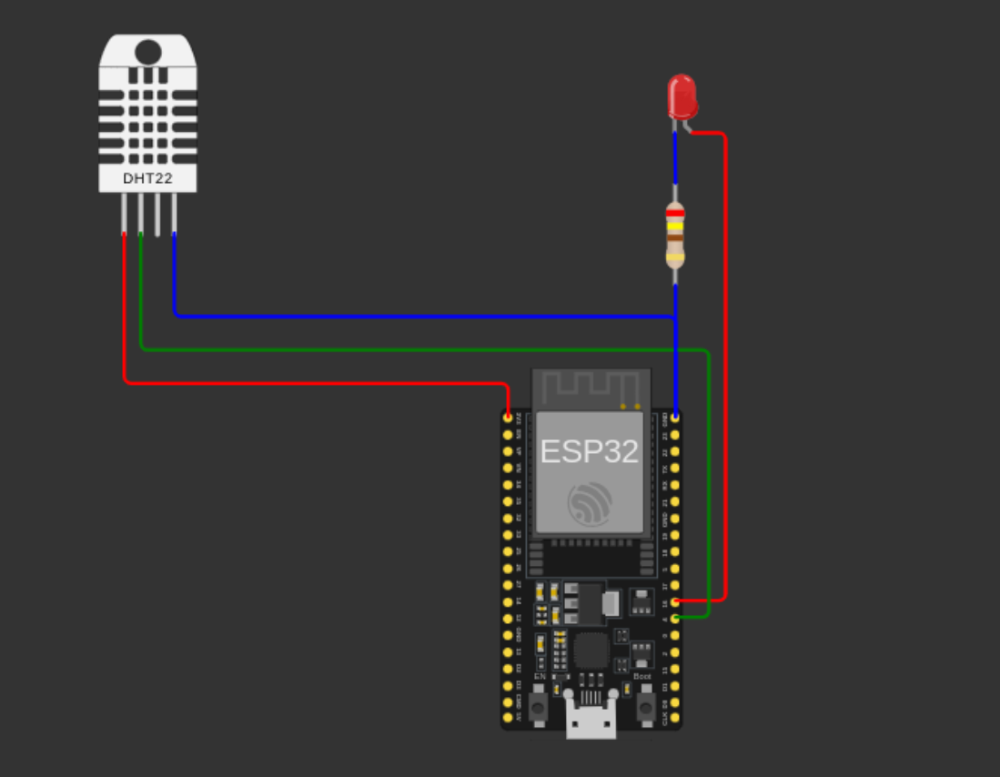

Im nächsten Schritt bauten wir einen Prototyp unserer Außenstation. Bevor wir mit der Einrichtung und Konfiguration des
Raspberry Pis begannen, entschieden wir uns dafür, den Prototyp gegen einen Mosquitto MQTT Broker in einem
Docker-Container zu testen. Diese Vorgehensweise ermöglichte es uns, die Kommunikation und Funktionalität unseres
Systems unter kontrollierten Bedingungen zu überprüfen.

Durch den Einsatz des Mosquitto Brokers in einem Docker-Container konnten wir eine stabile und flexible Testumgebung
schaffen. Dies war besonders wichtig, um sicherzustellen, dass unser Prototyp korrekt mit dem MQTT-Protokoll
kommunizieren konnte, ein essenzieller Bestandteil für die zuverlässige Übertragung der Sensordaten und die Steuerung
der Aktoren über das Netzwerk. Erst nach erfolgreichen Tests und der Gewährleistung, dass der Prototyp wie erwartet
funktionierte, gingen wir zur nächsten Phase über – der Einrichtung und Konfiguration des Raspberry Pi für den
Echtbetrieb.


Nachdem wir erfolgreich bestätigt hatten, dass unser Prototyp wie vorgesehen funktionierte, gingen wir zur nächsten
Phase über: dem Löten der Komponenten. Diese Entscheidung folgte dem Ziel, eine robuste und zuverlässige Einheit zu
schaffen, die sich einfach in unser selbstgebautes Gehäuse integrieren lässt.

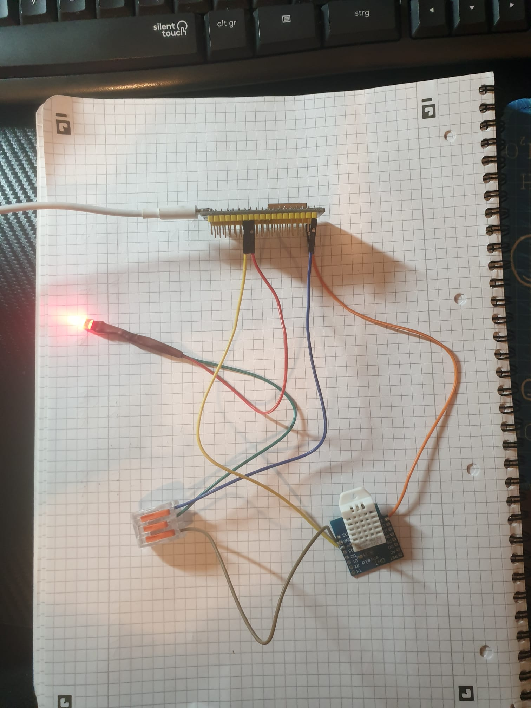

#### Code

Platformio Konfiguration

```ini
[env:esp32dev]
platform = espressif32
board = esp32dev
framework = arduino
monitor_speed = 115200
build_flags = 
	-I/home/jano/dev/CLionProjects/weather-station/src
lib_deps =
	adafruit/DHT sensor library@^1.4.6
	knolleary/PubSubClient@^2.8
	bblanchon/ArduinoJson@^6.21.5
```

Konfiguration

```c++
const char *ssid = "Toilet Cam";
const char *password = "!234Amsterdam";
const char *mqtt_server = "192.168.2.114";
const int mqtt_port = 1883;
const char *mqtt_topic_publish = "sensordata";
const char *mqtt_topic_subscribe = "led";
const int led_pin = 16;
const bool debug_mode = true;
const bool sleep_mode = false;
const unsigned long read_publish_delay = 30000;
const uint64_t deep_sleep_delay = 60e6;
const uint loop_delay = 250;
```

In unserem Projekt haben wir eine effiziente Struktur implementiert, indem wir Code-Teile aus den
Bibliotheksdokumentationen adaptiert und in spezifische Funktionen integriert haben.

Für eine kreative Erweiterung unseres Projekts entschieden wir uns, Morsecode in Echtzeit als On/Off-Befehle an den ESP
zu übertragen. Dies stellte uns vor die Herausforderung, die Sensordaten effizient zu lesen und zu senden. Um dies zu
bewältigen, haben wir uns für die Erstellung eines separaten Threads entschieden, wobei wir die Funktion xTaskCreate des
FreeRTOS nutzen. Diese Entscheidung ermöglichte es uns, eine parallele Verarbeitung zu implementieren, die für die
schnelle und zuverlässige Übertragung und Interpretation von Morsesignalen unerlässlich ist

```c++
void setup() {
    Serial.begin(115200);

    initializeDHT();
    initializeActuator();
    initializeWiFi();
    initializeMQTT();

    xTaskCreate(mqttPublishTask,"MQTTPublishTask", 10000, NULL, 1, NULL);
}

void loop() {
    if (!client.connected()) {
        reconnect();
    }
    client.loop();
    delay(250);
}
```

Für unser Projekt ist es entscheidend, dass der ESP32 nicht nur eine WiFi-Verbindung herstellt, sondern auch eine
zuverlässige Verbindung zu einem MQTT-Broker aufbaut. MQTT (Message Queuing Telemetry Transport) ist ein
leichtgewichtiges und effizientes Protokoll, das speziell für die Kommunikation in IoT-Umgebungen entwickelt wurde.
Durch die Einbindung von MQTT in unser System kann der ESP32 effektiv Daten senden und empfangen, was für die
Übertragung von Sensordaten und die Steuerung von Aktoren wie der LED über Netzwerkbefehle essentiell ist.

Diese duale Kommunikationsfähigkeit – sowohl über WiFi als auch über MQTT – erweitert die Funktionalität unseres Systems
erheblich, indem sie eine flexible und robuste Plattform für die Fernsteuerung und Datenübertragung bereitstellt.

```c++
void initializeMQTT() {
    client.setServer(mqtt_server, mqtt_port);
    client.setCallback(mqtt_broker_callback);
    client.subscribe(mqtt_topic_subscribe);
}
```

In unserem Projekt verwenden wir eine Callback-Funktion, um die über den MQTT-Broker empfangenen Daten zu verarbeiten.
Diese Callback-Funktion wird beim Broker registriert und ist dafür zuständig, auf eingehende Nachrichten zu reagieren.

```c++
void mqtt_broker_callback(char *topic, byte *payload, unsigned int length) {
    char message[length + 1];
    strncpy(message, (char *) payload, length);
    message[length] = '\0';
    if(debug_mode){
        Serial.print("Message arrived on topic: ");
        Serial.print(topic);
        Serial.print(". Message: ");
        Serial.println(message);
    }
    
    StaticJsonDocument<100> doc;
    DeserializationError error = deserializeJson(doc, message);
    if (error) {
        Serial.print("deserializeJson() failed: ");
        Serial.println(error.c_str());
        return;
    }

    const char *command = doc["command"];

    if (strcmp(command, "on") == 0) {
        setActuator();
    } else if (strcmp(command, "off") == 0) {
        unsetActuator();
    }
    client.loop();
}
```

Für das Senden von Daten in unserem Projekt nutzen wir einen nebenläufigen Prozess. Dieser Ansatz ermöglicht es, Daten
unabhängig vom Hauptprozesslauf zu senden, was die Effizienz und Reaktionsfähigkeit unseres Systems erheblich
verbessert.

Der Prozess arbeitet parallel zum Hauptprozess und nutzt die Fähigkeiten des ESP32, mehrere Aufgaben gleichzeitig zu
verwalten. Dies ist ein Schlüsselelement, um unser System zuverlässig und reaktionsschnell zu gestalten, insbesondere in
einem IoT-Kontext, wo eine effiziente Kommunikation von entscheidender Bedeutung sein kann.

```c++
[[noreturn]] void mqttPublishTask(void *pvParameters) {
    for (;;) {
        float temperature, humidity;
        readDHT(temperature, humidity);
        client.loop();
        String jsonTemperature = generateJson("Temperature", temperature, "C");
        client.publish(mqtt_topic_publish, jsonTemperature.c_str());
        String jsonHumidity = generateJson("Humidity", humidity, "%RH");
        client.publish(mqtt_topic_publish, jsonHumidity.c_str());
        if (sleep_mode) {
            Serial.println("Entering deep sleep mode");
            esp_deep_sleep(deep_sleep_delay);
        } else {
            vTaskDelay(read_publish_delay / portTICK_PERIOD_MS);
        }
    }
```

Ist sleep_mode = true, so wird der ESP nach einmaligem Senden in deep sleep versetzt und wenn debug_mode true ist,
werden die Aktionen des ESP über die serielle Schnittstelle geprinted.

### Server

Da wir uns entschieden hatten, Docker als Umgebung für unsere Anwendungen wie den MQTT-Broker, Webserver usw. zu
verwenden, war die Einrichtung des Raspberry Pi vergleichsweise unkompliziert. Wir spielten lediglich ein aktuelles
Raspbian Lite Image auf den Pi auf und konfigurierten den WLAN-Zugang. Dies ermöglichte es uns, den Raspberry Pi über
SSH fernzusteuern, was die Handhabung erheblich vereinfachte.

Nach der grundlegenden Konfiguration des Raspberry Pi gingen wir zum nächsten Schritt über: Wir klonten unser Repository
auf den Pi. Um die Handhabung unserer Anwendung zu vereinfachen, erstellten wir Bash-Skripte, die das Starten und
Beenden unserer Applikation automatisieren. Diese Skripte erleichterten die Verwaltung des Systems erheblich, da sie es
uns ermöglichten, komplexe Abläufe mit einfachen Befehlen zu steuern. Dadurch konnten wir die Effizienz unserer
Arbeitsabläufe verbessern und gleichzeitig potenzielle Fehlerquellen reduzieren, die bei manueller Ausführung auftreten
könnten.

```bash
#!/bin/bash
cd /home/sv2/weather-station/sv2/
docker-compose up --build --detach
```

Zusätzlich zu den Bash-Skripten haben wir systemd Services auf dem Raspberry Pi eingerichtet, um die Verwaltung unserer
Anwendung weiter zu optimieren. Diese systemd Services sind so konfiguriert, dass sie unsere Skripte automatisch beim
Starten und Herunterfahren des Raspberry Pi ausführen.

Durch die Verwendung von systemd Services konnten wir eine höhere Zuverlässigkeit und Effizienz erreichen. Diese
Services gewährleisten, dass unsere Anwendung korrekt gestartet wird, sobald der Raspberry Pi hochfährt, und sicher
heruntergefahren wird, wenn der Pi ausgeschaltet wird. Dies ist besonders wichtig, um die Integrität der Daten und die
Stabilität des Systems zu gewährleisten, da es das Risiko von Datenverlust oder -korruption minimiert.

```ini
[Unit]
Description=Start Weather Station Docker Compose
After=network.target

[Service]
Type=simple
User=sv2
ExecStart=/home/sv2/start_weather_station.sh

[Install]
WantedBy=multi-user.target
```

## Datenbank

In unserem Projekt wurde eine robuste Datenbankimplementierung durchgeführt, um die Übertragung und Speicherung von
Daten vom Sensor effizient zu verwalten. Die Haupttechnologien, die dabei verwendet wurden,
sind [Golang](https://go.dev/) als Programmiersprache, [GORM](https://gorm.io/) als ORM-Framework (Object-Relational
Mapping) und [SQLite](https://www.sqlite.org) als Datenbank.

### Datenübertragung und Speicherung

Die Daten vom Sensor werden in Echtzeit übertragen und sowohl im Arbeitsspeicher als auch in der SQLite-Datenbank
gespeichert. Dabei werden die neuesten Daten aus der Datenbank dynamisch im Arbeitsspeicher geladen und angezeigt,
sobald der Server gestartet wird. Dies ermöglicht eine schnelle und effektive Darstellung der aktuellen Datenlage.

### Implementierung

Die Wahl von GORM erwies sich als äußerst vorteilhaft, da es ein intuitives ORM-Framework ist. Die Einarbeitung
gestaltete sich trotz einiger Anfangsschwierigkeiten, aufgrund eines inkompatiblen Alpine-Docker-Images, recht
unkompliziert und die Flexibilität von GORM ermöglichte eine effiziente Datenbankinteraktion. Die dokumentierte API und
die aktive Community trugen dazu bei, die Entwicklungszeit zu optimieren.

Insgesamt bietet die implementierte Datenbanklösung eine stabile Grundlage für die Speicherung und Verwaltung von
Sensordaten, unterstützt durch die Zuverlässigkeit von Golang, die Leistungsfähigkeit von GORM und die Einfachheit von
SQLite.

## Anfertigung des Gehäuses für unsere Wetterstation

### Schritte zur Herstellung

#### 1. Anreißen der Bohrung und der Aussparungen

- **Zweck:** Markierung der Positionen für Bohrungen und Aussparungen.
- **Werkzeug:** Höhenanreißer.
- **Verfahren:**
    - Mit dem Höhenanreißer Positionen für Bohrungen und Aussparungen auf dem Material präzise markieren.
    - Sorgfältige Markierung gewährleistet spätere Passgenauigkeit.

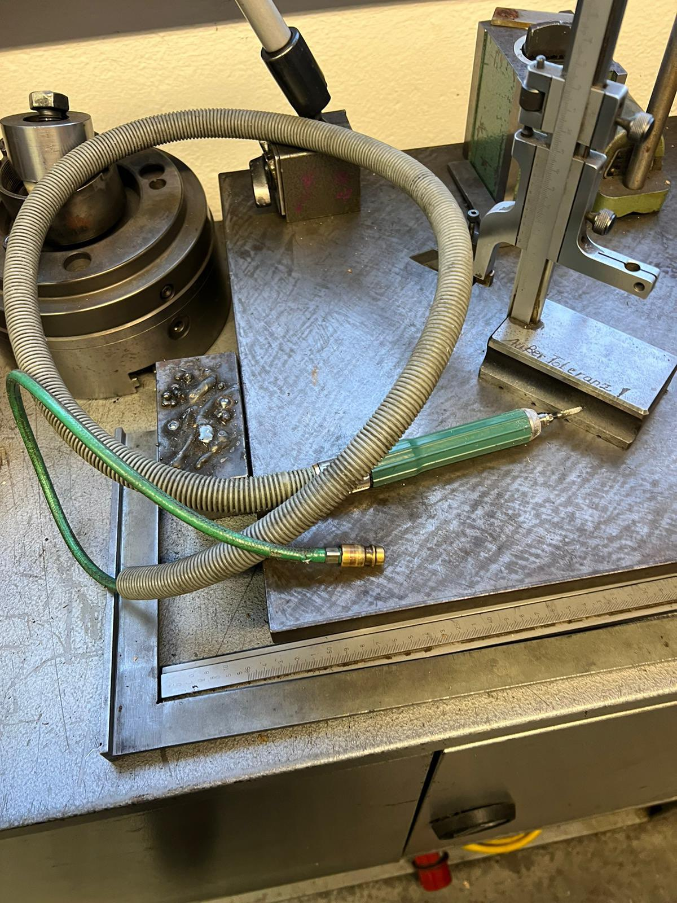

#### 2. Anfertigen der Aussparungen mit Pneumatikschleifer

- **Zweck:** Erstellen der Aussparungen für Komponenten der Wetterstation.
- **Werkzeug:** Pneumatikschleifer.
- **Verfahren:**
    - Aussparungen gemäß den Anreißmarkierungen schleifen.
    - Kontinuierliche Überprüfung der Maße zur Sicherstellung der Passgenauigkeit.

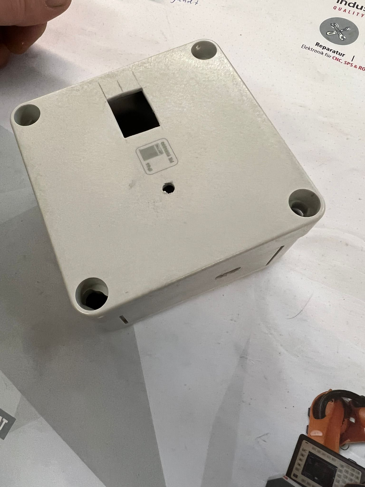

#### 3. Bohren an Standbohrmaschine

- **Zweck:** Erstellen präziser Bohrungen für die LED.
- **Werkzeug:** Standbohrmaschine, entsprechender Bohrer.
- **Verfahren:**
    - Material in die Standbohrmaschine einspannen.
    - Bohrungen an den markierten Stellen exakt durchführen.


#### 4. Entgraten der Kanten

- **Zweck:** Glättung und Sicherheitsverbesserung der bearbeiteten Kanten.
- **Werkzeug:** Entgratwerkzeug, Feile.
- **Verfahren:**
    - Scharfe und raue Kanten sorgfältig entgraten.
    - Gleichmäßige Bearbeitung zur Vermeidung von Materialschwächungen.

#### 5. Befestigung für den ESP durch Einkleben von Abstandhaltern

- **Zweck:** Fester Halt für den ESP und Sicherstellung das die CPU nicht auf Kunststoff aufliegt.
- **Material:** Abstandhalter, Klebstoff.
- **Verfahren:**
    - Abstandhalter an den vorgesehenen Positionen einkleben.
    - Sicherstellen, dass der ESP nicht direkt auf dem Kunststoff aufliegt, um Überhitzungsrisiken zu minimieren.
    - Ausreichende Aushärtezeit des Klebstoffs gewährleisten.

   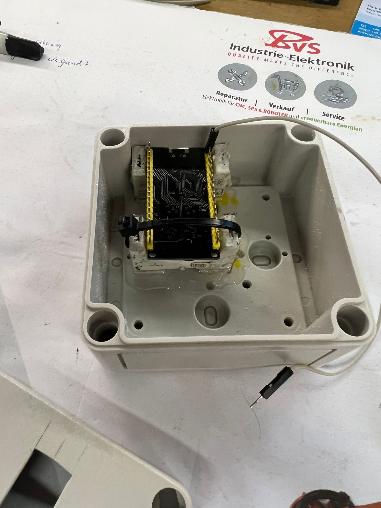

## Frontend Server

### Allgemein

Der Server ist in Go geschrieben.

Der Code ist hier verfügbar: https://github.com/Frank-Mayer/sv2

Die Typdefinitionen für Protobuf sind hier verfügbar: https://github.com/Frank-Mayer/sv2-types

Zur Kommunikation über MQTT kann JSON oder Protobuf verwendet werden.

### Dependencies

- [github.com/Frank-Mayer/sv2-types](https://github.com/Frank-Mayer/sv2-types)
- [github.com/charmbracelet/log](https://github.com/charmbracelet/log)
- [github.com/eclipse/paho.mqtt.golang](https://github.com/eclipse/paho.mqtt.golang)
- [google.golang.org/protobuf](https://google.golang.org/protobuf)

### Packages

Der Code ist in mehrere Packages aufgeteilt,
um diesen übersichtlicher zu gestalten.

`mqtt` Stellt über die Init Funktion eine Verbindung zum MQTT Server her.
Die `Sub` Funktion abonniert ein Topic und gibt einen Callback an,
der Nachrichten verarbeitet.
`Pub` sendet eine Nachricht an ein Topic.

Das Paket, `rest` stellt eine Restful JSON API zur Verfügung.
Dabei wird der HTTP-Server der Go-Standard-Bibliothek verwendet.

Alle Sensoren sind unter `/sensor` einsehbar.
Die Daten eines einzelnen Sensors sind unter `/sensor/{name}` einsehbar.

Das Paket `webui` wird von rest verwendet und liefert eine Web UI.
Diese wird aus einer HTML-Datei geladen.
Diese verwendet die Rest-API, um die aktuellen Daten zu erhalten.
Über einen Timer werden diese Daten alle 2 Sekunden aktualisiert.
Die Anzeige erfolgt über die chart.js Bibliothek (https://www.chartjs.org).
Die komplette Seide ist komplett in dieser einen HTML-Datei.

`save` speichert eingehende Daten (vom MQTT Server) in memory und in einer SQLite Datenbank.
Beim Start des Programms werden aus dieser SQLite Datenbank die alten Daten geladen.

#### Beispiele

Verwendung der `mqtt.Sub` Funktion um eine Nachricht zu empfangen.

```Go
mqtt.Sub("sensordata", func(data []byte) {
     msg := sv2_types.SensorData{}
     // try protobuf
     if err := proto.Unmarshal(data, &msg); err != nil {
         // try json
         if err := json.Unmarshal(data, &msg); err != nil {
             log.Error("failed to unmarshal message", "error", err, "data", data)
         }
     }
     log.Debug(
         "received message",
         "Name", msg.Name,
         "Value", msg.Value,
         "Unit", msg.Unit,
     )
     save.Add(msg.Name, msg.Value, msg.Unit)
})
```

Verwendung der `mqtt.Pub` Funktion um eine Nachricht zu senden.

```Go
mqtt.Pub("led", []byte("{\"command\":\""+on+"\"}"))
```

Beispieldaten von `/sensor`

```json
{
  "sensors": [
    {
      "name": "Temperature",
      "unit": "°C",
      "data": [
        {
          "value": 18.1,
          "time": 1705313038
        },
        {
          "value": 18.2,
          "time": 1705313039
        },
        {
          "value": 18.2,
          "time": 1705313040
        },
        {
          "value": 18.1,
          "time": 1705313041
        }
      ]
    }
  ]
}
```

Beispieldaten von `/sensor/Temperature`

```json
{
  "name": "Temperature",
  "unit": "°C",
  "data": [
    {
      "value": 18.1,
      "time": 1705313038
    },
    {
      "value": 18.2,
      "time": 1705313039
    },
    {
      "value": 18.2,
      "time": 1705313040
    },
    {
      "value": 18.1,
      "time": 1705313041
    }
  ]
}
```